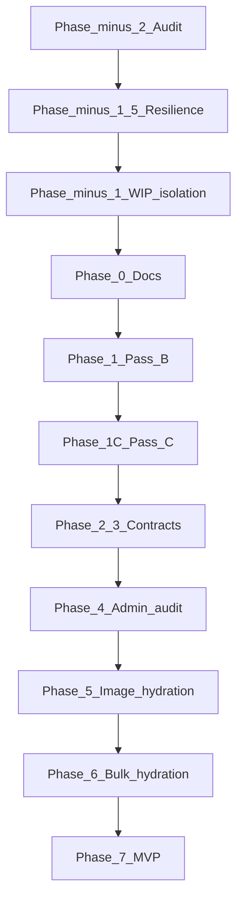

# xi-io Emulator — Master Plan (May 2026)

Date: 2026-05-28  
Status: **Active — canonical planning document**  
Repo health: **YELLOW** (three-bucket integration pass 2026-05-30; HW proof still open)  
Milestone: **XARCADE-CONTROLLER-LAUNCH-PROOF-001** (Pass B partial / blocked)

> **Canonical location:** This file is the source of truth for project planning.  
> Cursor plan `.cursor/plans/master_plan_session_bf1bd80a.plan.md` mirrors this document for IDE convenience only.  
> If they diverge, **this repo file wins**.

---

## How agents should use this plan

1. Read `README.md` → `docs/INDEX.md` → **this file** → `open-work-ledger.md`
2. Check [repo-health-audit-2026-05.md](./repo-health-audit-2026-05.md) for current RED/YELLOW/GREEN status
3. Execute **only the current phase**; do not skip gates
4. End every phase with: git status summary, gates checklist, report path, next phase prompt
5. **No mixed commits** — docs and source in separate commits per phase

---

## Global guardrails (non-negotiable)

- Do **not** bulk-scan or hydrate the full SNES library (11,337 ROMs) until Pass B/C + image hydration gates pass
- Do **not** close Pass B or Pass C without user hardware evidence
- Do **not** produce text-only `GameRecord` rows at bulk scale
- Do **not** mutate user ROM files (read-only import by reference)
- Showcase hydration is **fixture-only** — not XARCADE-IMAGE-HYDRATION-001
- Default branch for GitHub: **`origin/main`** (local branch may be `master` until aligned)

---

## Phase overview

| Phase | Name | Gate to proceed |
|-------|------|-----------------|
| **-2** | Repo file-health audit | Peer review of audit report |
| **-1.5** | Audit resilience | Script + audit doc in repo; resumable |
| **-1** | WIP isolation + branch hygiene | Clean or intentionally isolated tree |
| **0** | Documentation refresh | Missing planning docs committed (docs-only) |
| **1** | Pass B core (launch/exit/controller) | Hardware checklist signed |
| **1C** | Pass C milestone close | Pass B complete only |
| **2–3** | Hydration + arcade surface contracts | Contract docs committed |
| **4** | Admin feature audit (scored) | admin-feature-audit-index populated |
| **5** | Image hydration Pass D–F | Pilot 50 → stress 100 |
| **6** | Bulk hydration (gated) | Dry-run + SQLite if required |
| **7** | MVP hardening Pass K–L | Admin audit scores drive fixes |



---

## Phase -2 — Repo file-health audit

**Deliverable:** [repo-health-audit-2026-05.md](./repo-health-audit-2026-05.md)  
**Classification (2026-05-28):** **RED**

Summary:

- `master` is **4 commits ahead** of `origin/main`; ~29 modified + ~21 untracked files mixing Pass B, showcase, UI framework, docs
- Missing canonical docs on disk until this planning session creates them
- `origin/docs/xibalba-ui-framework-001` exists on remote; not merged locally
- INDEX / ledger / hydration YAML lag launch hardening and showcase work

**Acceptance:** Peer review approves audit report; must-fix list acknowledged before Phase -1 execution.

---

## Phase -1.5 — Audit resilience

Prevent chat-only planning and non-resumable audits.

**Deliverables:**

| Artifact | Purpose | Status |
|----------|---------|--------|
| [scripts/repo-health-audit.sh](../../scripts/repo-health-audit.sh) | Regenerate `.tmp/audit-*.txt` locally | **Created** |
| [repo-health-audit-2026-05.md](./repo-health-audit-2026-05.md) | Human-readable audit | **Created** |
| [historical-plans-consolidation.md](./historical-plans-consolidation.md) | Merged open items from all prior plans | **Created** |
| **This file** | Canonical master plan in repo | **Created** |

**Acceptance:**

- [x] `bash scripts/repo-health-audit.sh` exits 0
- [x] Audit sections 1–17 exist in repo markdown
- [x] Remote UI framework branch diff recorded (§12 audit)
- [ ] Peer review signed (blocks Phase -1)

---

## Phase -1 — Repository hygiene and WIP isolation

**Do not start feature implementation on ambiguous dirty tree.**

### Acceptance

- [x] WIP file→branch map written (`wip-branch-map-2026-05.md`)
- [x] Pass B lifecycle / launch hardening on `wip/pass-b-lifecycle-display-shell`
- [x] Showcase fixtures merged into WIP (bucket C services + components, 2026-05-30)
- [x] UI framework CSS merged into WIP from `feature/ui-framework-001` (2026-05-30)
- [ ] `git status` clean on WIP after integration commits
- [ ] Peer review signed (blocks push to `origin/main`)
- [x] Decision recorded: merge `origin/docs/xibalba-ui-framework-001` (docs-only, merged 2026-05-29)
- [x] `master` vs `main` policy documented in README
- [x] Repo health **YELLOW** minimum for continued Pass B work

### XIBALBA-UI-FRAMEWORK-001 checkpoint

- Review `origin/docs/xibalba-ui-framework-001` (docs-only expected)
- Merge if safe; resolve `docs/INDEX.md` conflicts
- Record in ledger: **XARCADE-UI-FRAMEWORK-001** is a **consumer** of XIBALBA standard — no new emulator UI primitives until relationship is indexed

### Commit / PR discipline

- No mixed docs + source commits
- Every pass: start with allowed-files list; end with gates + report
- Peer review targets **repo files**, not chat transcripts

---

## Phase 0 — Documentation refresh

Update high-signal docs only. **Docs-only commits.**

| File | Action |
|------|--------|
| `README.md` | Status, `tauri:dev`, `verify:engine-launch`, runbook link, branch policy |
| `docs/INDEX.md` | Bump date; link master plan, audit, contracts, admin audit index |
| `open-work-ledger.md` | Launch hardening, audit resilience, reconcile Workbench event |
| `docs/operations/troubleshooting-pass-b.md` | Freeze section; Flatpak; loading-then-nothing |
| `docs/operations/launch-failure-codes.md` | XIO-LCH-014–016 + parity matrix |
| `docs/roadmap/remaining-work-pass-plan.md` | Phases -2 through 0; checkpoint date |
| `projects/hydration/xi_io_emulator.hydration-state.yaml` | `launch_hardening`, showcase boundary |
| [feature-matrix.md](./feature-matrix.md) | Cross-surface feature inventory |
| [admin-feature-audit-index.md](./admin-feature-audit-index.md) | Scoring template |
| [../contracts/hydration-completeness-checklist.md](../contracts/hydration-completeness-checklist.md) | Per-game completion |
| [../contracts/arcade-surface-field-spec.md](../contracts/arcade-surface-field-spec.md) | Card + microsite fields |

---

## Pass B hardening — proof classification

Classify each item before Pass C. Update this table as evidence arrives.

| Item | Local | Committed | Pushed | HW verified | Documented | Accepted |
|------|-------|-----------|--------|-------------|------------|----------|
| `prepare_launch` / `validate_launch_plan` | Yes | Partial | No | No | No | No |
| `session_startup` poll (~12s) | Yes | No | No | No | No | No |
| Flatpak / `finalizeEngineLaunch` | Yes | Partial | No | No | No | No |
| Exit guardrails / `shell_restore.rs` | Yes | Yes (WIP) | No | Partial | Yes | Partial |
| Preflight `validateLaunchPlan` | Yes | Yes | No | No | Yes | No |
| Session lifecycle hook / error overlay | Yes | Yes | No | No | Yes | No |
| Three-bucket UI integration (A+B+C) | Yes | Partial | No | N/A | Partial | Partial |
| Arcade browse toolbar CSS + GameTile | Yes | Yes (2026-05-30) | No | Pending | Yes | No |
| Showcase hydration (~42 titles) | Yes | Yes (staged→commit) | No | N/A | Partial | Partial |
| Shell exit / display picker | Mixed | Partial | No | Pending | Partial | No |
| Single-instance flock | Yes | Unknown | No | Pending | Partial | No |

---

## XARCADE-CONTROLLER-MAPPING-001

**Pass B blocker** — cannot defer A/B before Pass C.

- FCEUX: D-pad, Start, Select, **A, B** at launch
- RetroArch: D-pad, Start, Select, **A, B** at launch
- Mapping source explicit; manual emulator config path documented if needed
- Turbo may defer

---

## Showcase hydration boundary

- Fixture/showcase-only — **not** XARCADE-IMAGE-HYDRATION-001
- Must not justify bulk import
- Records require `dataSource` + `provenanceLabel` (see hydration contract)
- No believable fake data without visible provenance in UI

---

## Phase 1 — Core solidification (Pass B close)

**Gate:** No bulk hydration until evidence-backed.

### 1A — Launch / exit paths (user + agent)

- SNES via Pass B Launch Proof shelf (not demo `/media/arcade-usb/` tiles)
- `npm run verify:engine-launch` matches Aries paths
- NES exit/return retest after hardening
- Desktop-freeze retest on game exit
- Acceptance: `session_reached_game: true`; no silent loading dismiss

### 1B — Controller-only arcade navigation

Files: `ArcadeHome.tsx`, `ArcadeGameDetail.tsx`, `useArcadeGamepadListener.ts`, `ControllersPanel.tsx`

- Shelves, search, platform tabs, card actions, microsite, display picker, error recovery, Esc / shell-exit during session

### 1C — Pass C (agent, **only after Pass B**)

Update: proof report, ledger, hydration YAML, framework sync per `docs/agent-master-prompt-current-next.md`

---

## Phase 2 — Hydration completeness contract

See [hydration-completeness-checklist.md](../contracts/hydration-completeness-checklist.md).

**Operational today:** all steps in `ingressChecklistDefinition.ts` pass (none failed/pending).

**Required provenance fields (before bulk):**

- `dataSource`, `provenanceLabel`, `confidence`, `reviewStatus`, `lastVerifiedAt`
- Artwork: `source`, `confidence`, `reviewStatus`, `localCachePath?`, `providerCandidate?`

**Rule:** Missing artwork → review state; must not block play once `launch_ready` passes.

---

## Phase 3 — Arcade surface field spec

See [arcade-surface-field-spec.md](../contracts/arcade-surface-field-spec.md).

---

## Phase 4 — Admin page-by-page audit

See [admin-feature-audit-index.md](./admin-feature-audit-index.md).

**Score dimensions (1–5):** Built, UX, Controller, No silent failure, **Honesty/provenance**

**Order:** Engines → Controllers → Library → Storage → Settings → Logs → GameDetailPanel (each tab)

---

## Failure-code parity matrix

Maintain in `docs/operations/launch-failure-codes.md`:

| Code | UI surface | Ledger | Source | Runbook | Implemented |
|------|------------|--------|--------|---------|-------------|
| XIO-LCH-001–013 | (existing) | partial | mixed | yes | partial |
| XIO-LCH-014 startup timeout | launch overlay | launch_failed | `session_startup.rs` | TBD | code yes |
| XIO-LCH-015 Flatpak/supervisor parse | launch overlay | launch_failed | `engine_launch.rs` | TBD | code yes |
| XIO-LCH-016 preflight validation | hero blockers | launch_blocked | `validate_launch_plan` | TBD | code yes |

---

## Phase 5 — Image hydration (Pass D–F)

- Rosetta + local artwork + fallback metadata + review queue
- Pilot **50** titles → stress **100**
- Not the same as showcase fixture hydration

---

## Phase 6 — Bulk hydration

### Pass schedule

| Pass | Games | Scope |
|------|-------|-------|
| P0 Proof | 2 | Pass B hand-picked NES + SNES |
| P1 Showcase | ~42 | Curated fixture catalogs |
| P2 Image pilot | 50 | Rosetta + review UX |
| P3 Image stress | 100 | Hacks/regions/translations |
| P4 Dry-run | 11,337 | Metadata index only (Pass H) |
| P5 First hydrate | 100–150 | Pre-SQLite safe max |
| P6+ Chunks | 500–1000/pass | After SQLite + virtualization |

### XARCADE-BATCH-RESUME-001 (required before full bulk)

- Checkpoint file or DB row, resume token, cancel, rollback strategy
- Failed / skip / retry lists; batch ledger events

### SQLite gate (hard)

If P4 dry-run shows localStorage/UI cannot stay responsive → **SQLite mandatory** before P5.

---

## Phase 7 — MVP hardening (Pass K–L)

- Real read-only filesystem scan
- Virtualized library grid
- Admin UX polish from Phase 4 scores
- Packaging / release readiness

---

## Backlog (audited, still relevant)

Full cross-reference of open items from prior plans: [historical-plans-consolidation.md](./historical-plans-consolidation.md)

### Active (Pass B / Phase 0–1)

| ID | Item | Phase |
|----|------|-------|
| B1 | XARCADE-CONTROLLER-MAPPING-001 — A/B at launch (`#todo:controller/profile-mapping`) | 1 |
| B2 | Shell focus failure ledger (XIO-LCH-008) | 1 / 7 |
| B3 | Display identify surfacing (XIO-LCH-009) | 1 / 7 |
| B7 | Launch hardening docs + XIO-LCH-014–016 parity | 0 |
| B8 | Merge `origin/docs/xibalba-ui-framework-001` (5 docs, no source) | -1 |
| B9 | WIP tree isolation (~50 files mixed) | -1 |
| B10 | master/main branch alignment + push 4 commits | -1 |
| H-PB-01–07 | Pass B checklist items | 1 |

### Gated (post Pass C)

| ID | Item | Phase |
|----|------|-------|
| B4 | XARCADE-IMAGE-HYDRATION-001 + Rosetta + `#todo:rosetta/local-alias-map` | 5 |
| B5 | XARCADE-STORAGE-001 + `#todo:storage/read-only-source-root` | 6 |
| B6 | XARCADE-BATCH-RESUME-001 | 6 |
| B11 | SQLite migration (if dry-run requires) | 6 |
| B12 | Framework/xi-io.net mirror + Workbench reconcile | 1C |
| H-IC-01 | XARCADE-SEARCH-001 search/filters MVP | 7+ |
| H-M2-01–07 | Backlog M2 slices — verify in feature-matrix | 4 / 7 |

### Admin / UX (Phase 4)

| ID | Item |
|----|------|
| H-UX-01–06 | ui-page-review findings, mock tabs, Radix focus trap |

**Deferred:** PS1/PS2, cloud sync, metadata scraping, Ibal AI (`#todo:assistant/provider-contract`), MCP, platform engine registry **implementation**, media extension track, cheats/hacks execution, Bluetooth controllers, `#todo:architecture/path-helper-service`.

---

## Framework sync checkpoint (Pass C)

- [ ] `open-work-ledger.md` updated
- [ ] `docs/framework/xi-io-net-sync-status.md` updated
- [ ] Workbench event aligned
- [ ] `xi_io_emulator.hydration-state.yaml` aligned
- [ ] Branch/commit SHAs recorded

---

## Success criteria — ready for full hydration

- [ ] Repo health **GREEN** or **YELLOW** with must-fix cleared
- [ ] Pass B checklist complete
- [ ] Pass C closed
- [ ] Launch hardening documented + HW verified
- [ ] Contracts + admin audit index committed
- [ ] Image hydration pilot 50→100 complete
- [ ] P4 dry-run 11,337 complete
- [ ] XARCADE-BATCH-RESUME-001 + SQLite (if required) implemented
- [ ] First P5 batch 100–150 succeeds with resume

---

## Recommended execution order

1. Phase -2 peer review (audit report + historical consolidation) ← **submit for review**
2. Phase -1 WIP isolation (after peer review)
3. Phase 0 docs-only commit (runbook, failure codes, INDEX sync)
4. Phase 1 Pass B (+ XARCADE-CONTROLLER-MAPPING-001)
5. Phase 1C Pass C
6. Phases 2–4 contracts + admin audit scoring
7. Phases 5–7 hydration and MVP

---

## Related documents

```txt
docs/project-tracking/repo-health-audit-2026-05.md
docs/project-tracking/historical-plans-consolidation.md
docs/project-tracking/open-work-ledger.md
docs/project-tracking/admin-feature-audit-index.md
docs/project-tracking/feature-matrix.md
docs/roadmap/remaining-work-pass-plan.md      ← Pass B–L estimates (reference)
docs/backlog.md                               ← XARCADE-* slice IDs (reference)
docs/operations/launch-failure-codes.md
docs/operations/troubleshooting-pass-b.md
projects/hydration/xi_io_emulator.hydration-state.yaml
scripts/repo-health-audit.sh                  ← regenerate .tmp/audit-*.txt
```
